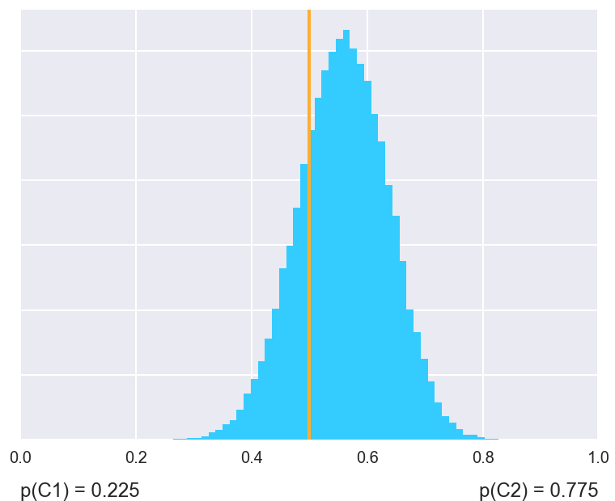

.. currentmodule:: baycomp

Classes with tests
==================

The two shortcut functions uses classes that actually prepare samples of
posteriors, compute probabilities and plot the distributions.

Let `nbc` and `j48` contain average performances of two methods for a
collection of data sets. With shortcut functions, we computed the
signed-ranks test with

    >>> two_on_multiple(nbc, j48, rope=1)
    (0.23014, 0.00674, 0.76312)

This is equivalent to calling `SignedRankTest.probs`:

    >>> SignedRankTest.probs(nbc, j48, rope=1)
    (0.23014, 0.00674, 0.76312)

We may choose a different test, the `SignTest`:

    >>> SignTest.probs(nbc, j48, rope=1)
    (0.26344, 0.13722, 0.59934)

To plot the distribution, we call ::

    >>> fig = SignedRankTest.plot(nbc, j48, rope=1)

Or we may prefer to see as a histogram:

    >>> fig = SignedRankTest.plot_histogram(nbc, j48, names=("nbc", "j48"))

Using test classes instead of shortcut functions offers more control and
insight in what the tests do.

Single data set
---------------

The test for comparing two classifiers on a single data set is implemented
in class :obj:`CorrelatedTTest`.

The class uses a Bayesian interpretation of the t-test
(`A Bayesian approach for comparing cross-validated algorithms on multiple
data sets <http://link.springer.com/article/10.1007%2Fs10994-015-5486-z>`_,
G. Corani and A. Benavoli, Mach Learning 2015).

The test assumes that the classifiers were evaluated using cross
validation. The number of folds is determined from the length of the vector
of differences, as `len(diff) / runs`. Computation includes a correction
for underestimation of variance due to overlapping training sets
(`Inference for the Generalization Error
<http://link.springer.com/article/10.1023%2FA%3A1024068626366>`_,
C. Nadeau and Y. Bengio, Mach Learning 2003).

.. autoclass:: CorrelatedTTest
    :members:

Multiple data sets
------------------

The library has three tests for comparisons on multiple data sets:
a sign test (:obj:`SignTest`), a signed-rank test (:obj:`SignedRankTest`)
and a hierarchical t-test (:obj:`HierarchicalTest`).

All classes have a common interface but differ in the computation of
the posterior distribution. Consequently, some tests have specific additional
parameters.

Common methods
..............

The common behaviour of all tests is defined in the class
:obj:`~baycomp.baycomp.Test`.

.. autoclass:: baycomp.multiple.Test
    :members:
    :member-order: bysource

Note that all methods are class methods. Classes are used as nested namespace.
As described in the next section, it is impossible to construct an instance of
a `Test` or derived classes.

Tests
.....

.. autoclass:: SignTest

.. autoclass:: SignedRankTest

.. autoclass:: HierarchicalTest

    The test is based on following hierarchical probabilistic model:

    .. math::

        \mathbf{x}_{i} & \sim MVN(\mathbf{1} \mu_i,\mathbf{\Sigma_i}),

  	    \mu_1 ... \mu_q & \sim t (\mu_0, \sigma_0,\nu),

  	    \sigma_1 ... \sigma_q & \sim \mathrm{unif} (0,\bar{\sigma}),

        \nu & \sim \mathrm{Gamma}(\alpha,\beta),

    where :math:`q` and :math:`i` are the number of datasets and the number
    of measurements, respectively, and

    .. math::

        \alpha & \sim \mathrm{unif} (\underline{\alpha},\overline{\alpha}),

        \beta & \sim \mathrm{unif} (\underline{\beta}, \overline{\beta}),

        \mu_0 & \sim \mathrm{unif} (-1, 1),

        \sigma_0 & \sim \mathrm{unif} (0, \overline{\sigma_0}).

    Parameters :math:`\underline{\alpha}`, :math:`\bar{\alpha}`,
    :math:`\underline{\beta}`, :math:`\bar{\beta}` and
    :math:`\bar{\sigma_0}` can be set through keywords arguments.
    Defaults are `lower_alpha=1`, `upper_alpha=2`, `lower_beta = 0.01`,
    `upper_beta = 0.1`, `upper_sigma=1000`.
