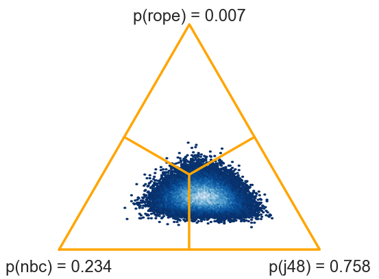
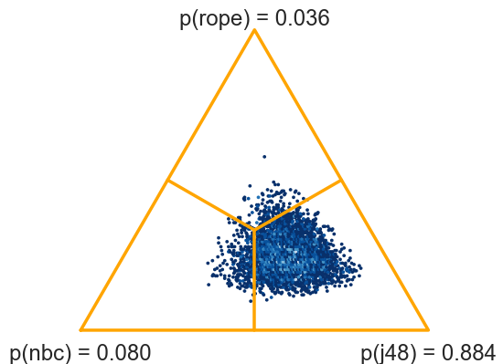

.. currentmodule:: baycomp

Shortcut functions
==================

Single data set
---------------

The simplest way to compare two classifiers on a single data set is to
call a function :obj:`two_on_single`.

.. autofunction:: two_on_single

Let `nbc` and `j48` be `numpy` arrays with classification accuracies
of naive Bayesian classifier and J48 obtained by cross-validation on some
data set. Function :obj:`two_on_single` computes the probability that NBC is
better than J48 and vice versa.

    >>> two_on_single(nbc, j48)
    (0.4145119975061462, 0.5854880024938538)

There is a 58.5 % probability that the average performance of J48 on this
problem is better than that of NBC. We can add rope: let us consider the two
methods equivalent if their classification accuracies differ by less than 0.5.
(Recall again that `rope` is on the same scale as `nbc` and `j48`. If they
are in percents, so is the rope.)

    >>> two_on_single(nbc, j48, rope=0.5)
    (0.28584464173791002, 0.2691518716880249, 0.44500348657406508)

There is a 26.9 % chance that the difference between the two classifiers is
negligible (that is, smaller than 0.5). There is 44.5 % probability that
J48 is better than NBC and 28.6 that NBC is better.

We can observe the posterior distribution of differences graphically. With an
additional argument `plot=True`, the function returns the probabilities and a
density plot, which we can save to a file.

    >>> names = ("nbc", "j48")
    >>> probs, fig = two_on_single(nbc, j48, plot=True, names=names)
    >>> print(probs)
    (0.4145119975061462, 0.5854880024938538)
    >>> fig.savefig("t-no-rope.svg")

.. image:: _static/t-norope.svg
    :width: 400px

The printed probabilities, `(0.4145119975061462, 0.5854880024938538)`,
equal the areas to the left and right of the orange line that marks the zero
difference.

    >>> probs, fig = two_on_single(nbc, j48, rope=0.5, plot=True, names=names)
    >>> print(probs)
    (0.28584464173791002, 0.2691518716880249, 0.44500348657406508)
    >>> fig.savefig("t.svg")

.. image:: _static/t.svg
    :width: 400px

With rope, we get three probabilities,
`(0.28584464173791002, 0.2691518716880249, 0.44500348657406508)`, that
correspond to areas to the left of rope, within it (between the orange lines)
and right of rope.

Multiple data sets
------------------

Function :obj:`two_on_multiple` compares classifiers tested on multiple data
sets.

.. autofunction:: two_on_multiple

Let `nbc` and `j48` now contain average performances of the two methods for
all data sets. In our case, we have 54 data sets, so `nbc` and `j48` are
1-dimensional arrays with 54 elements.

The following code uses a Bayesian version of signed-ranks (Benavoli et al,
2014) to compute the posterior distribution. ::

    >>> two_on_multiple(nbc, j48, rope=1)
    (0.23014, 0.00674, 0.76312)

There is 76.3 % probability that J48 is better than NBC.

    >>> probs, fig = two_on_multiple(nbc, j48, rope=1, plot=True, names=names)
    >>> fig.savefig("signedrank.png")

This test is computed from averages on data sets. We can also pass the entire
data, that is, `nbc` and `j48` as 54x10 matrices containing 10 scores for
each of 54 data sets. The function will switch from signed-ranks test to a
hierarchical model (Corani et al, 2015).

    >>> probs, fig = two_on_multiple(nbc, j48, rope=1, plot=True, names=names)
    (0.0795, 0.0365, 0.884)

If the results are obtained by multiple runs of cross validation, we must
not forget to specify the number of runs.

