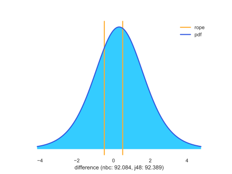

Bayesian comparison of learning algorithms for dummies
========================================================

What are the test about?
------------------------

This time, let us start with comparison of multiple classifiers. Say that
we have compared algorithms A and B on 50 data sets; algorithm A was better
on 30, and B won on 20.

Our goal is to determine the probability that given a new data set
(of a similar kind as data sets on which we compared the classifiers so far)
A will perform better than B (and the opposite). With A being better on 30
data sets, we can - without any fancy Bayesian stuff - say that the
probability of A being indeed better (on this kind of data sets) is 0.6,
and the probability that B is better is 0.4.

But is it really? What we have is only a single measurement on some specific
50 data sets out of many other possible data sets of reasonably similar kind.
A single sample, so to speak. A single sample giving a single result - 0.6 for
A and 0.4 for B. This sample comes from some distribution; if we repeated this
experiment (on the same or other data sets), the result could have been
different, say 0.55 for A and 0.45 for B. Or (way less likely) 0.2
for A and 0.8 for B. Or ... maybe it is *our result*, 0.6 vs 0.4 that was
unlikely? We cannot know.

With a Bayesian approach, we start with a *prior distribution*. A reasonable
prior would state that the two algorithms are equal, and that our belief in
this equality is of such and such strength. After making experiments (like
above), we adapt our prior distribution accordingly and get a *posterior
distribution*. This is then a distribution for which we believe that our
single sample (0.6  vs. 0.4) was drawn.

Sometimes we can deal with posterior distributions analytically. When not
(comparison on multiple data sets is a case of a "*not*", while for a single
data set we can do it), we use Monte Carlo sampling. We produce a large
number (`baycomp`'s default is 50000) samples from the posterior distribution.
Every sample gives the probability of A being better; most will be close to
0.6, but they will spread around and in some cases go below 0.5, which means
that this sample predicts that B is in fact better than A.

First thing we can do is to count the number of samples on which A was better.
If it was better on 27000 out of 50000 samples, than we predict that there is
a 27000 / 50000 = 0.54 chance that A is better than B.

Second, we can observe the distribution of samples. We can for plot it, as a
histogram ... or do something even better, as we'll see later.

And for a single data set?
--------------------------

The story there is similar.
We have two classifiers, we measure differences in their performance using
cross-validation and the average difference was, say, 2.5 if favour of A. If we
repeated the experiment, we could have gotten various differences - the
difference will sometimes will rise to 3, sometimes it will be as low as 0.5
and sometimes B will even win. Now, imagine that we draw 50000 samples, like
above, and count how many times A won. If the difference was positive (in
favour of A) in 30000 cases, there is a 60 % probability that A is better.

Except that here we don't have to draw 50000 samples since we can model the
distribution analytically and compute the expected number of wins for A. This
is more accurate and also faster.

.. image:: _static/t-norope.svg
    :width: 400px

How is this different from testing null-hypotheses?
---------------------------------------------------

When the null-hypothesis test gives a p-value of 0.05, this means that there
is only a 5 % probability of getting such (or more) extreme differences if the
classifiers are equal. This is thus the probability of the data and does not
tell anything about the probability that A is better then B.

Once again: no, getting a p-value of 0.5 doesn't mean that there is a 95 %
chance that A is better than B.

Bayesian tests give us exactly that: the actual probability of A being better
than B.

This is only the practical aspect of the difference. (And you'll see one
more below.) There are however plenty of reasons why null-hypothesis testing
is not only impractical but also plain wrong.

And what about the rope?
------------------------

This is the best thing about Bayesian tests: we don't get just a number, we
get a distribution, which we can query. One practical way to use it is this
one: would you consider a classifier A better than B, if the accuracy of A is
85.14 % and the accuracy of B is 85.13 %? It surely is, but the difference is
negligible in practice, right? (Is this statistically significant? It depends
upon the sample size. Collect enough data, and this difference will become
significant.)

With Bayesian tests, we can decide for a *region of practical equivalence*,
or *rope*.

The size of the rope depends on the use case. Say that we would consider
a pair of classifier that differ by less than 0.5 equivalent. If so,
we have three possibilities. Either A is better than B by more than 0.5;
or B is better than A by more than 0.5; or the difference is within rope,
that is, smaller than 0.5.

Now, we can go back and revisited what we said above. In case of comparisons on
multiple data sets, we gave an example in which "*we have compared algorithms
A and B on 50 data sets; algorithm A was better on 30, and B won on 20*" and
that hence "*the probability of A being indeed better (...) is 0.6,
and the probability that B is better is 0.4.*" Now the example may change to
something like "algorithm A was better on 25, B was better on 10 and they were
within 0.5 percent in the remaining 15", so "the probability that A is better
is 0.5, the probability that B is better is 0.2, and they are equivalent
with a probability of 0.3".

Similar story for a single data set: we can compute the distribution of
differences and instead of counting the cases in which A or B won (or
computing the areas to the left and the right of zero in the density plot),
we split the cases or the plot into three regions, the middle one
containing the negligible differences.

